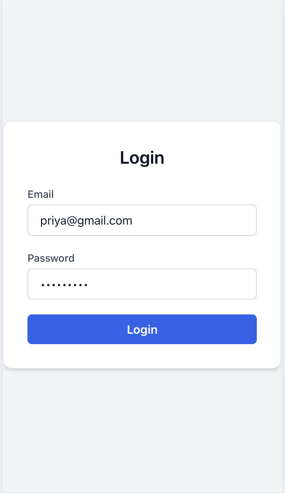
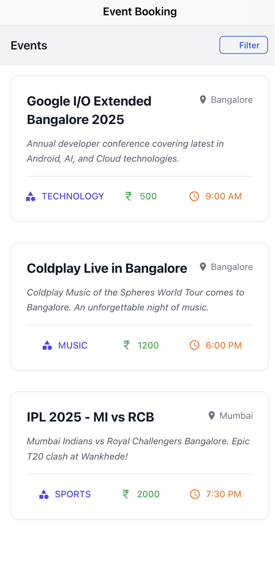
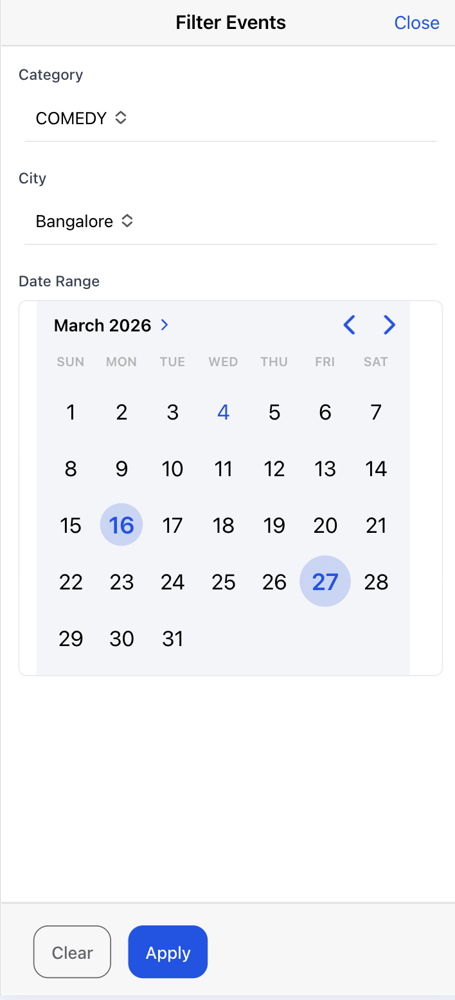
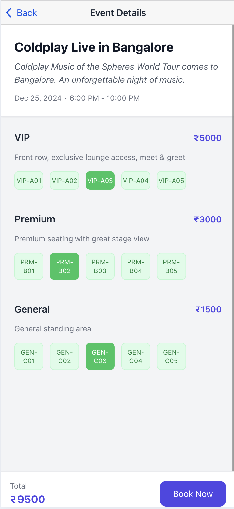
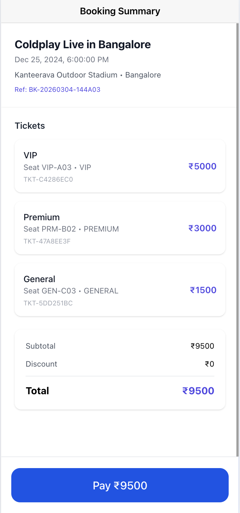

# 🎟️ Event Booking — Ionic / Angular Mobile App

A cross-platform mobile application for browsing and booking event tickets, built with **Angular**, **Ionic**, **NgRx**, and **Tailwind CSS**. Connects to a Spring Boot backend with JWT authentication.

---

## 📱 Screenshots

<p align="center">
  
  
  
  
  
</p>

---

## 🚀 Features

- **JWT Authentication** — Login, register, and auto-logout on token expiry (`401`)
- **Event Browsing** — Filter events by city, date range, and category
- **Event Detail** — View available seats grouped by ticket type
- **Seat Selection** — Select seats with real-time availability, held for 10 minutes on booking
- **Booking Flow** — Create bookings with idempotency key to prevent duplicate submissions
- **Booking Summary** — View booking confirmation with ticket codes
- **NgRx State Management** — Auth token and UI state managed globally
- **HTTP Interceptors** — Auth token injected on every request; errors handled centrally
- **Route Guards** — `AuthGuard` protects private routes; `LoginGuard` redirects authenticated users

---

## 🛠️ Tech Stack

| Layer | Technology |
|---|---|
| Framework | Angular 17+, Ionic 7 |
| State Management | NgRx (Store, Effects, Actions) |
| Styling | Tailwind CSS, SCSS, Ionic Components |
| Mobile | Capacitor (iOS / Android) |
| HTTP | Angular HttpClient with Interceptors |
| Auth | JWT (decoded client-side for idempotency keys) |
| Language | TypeScript |
| Linting | ESLint |
| Testing | Karma, Jasmine |

---

## 📁 Project Structure

```
src/
├── app/
│   ├── core/
│   │   ├── guards/
│   │   │   ├── auth.guard.ts            # Redirects to /login if no token
│   │   │   └── login.guard.ts           # Redirects to /events if already logged in
│   │   ├── interceptors/
│   │   │   ├── auth.interceptor.ts      # Attaches Bearer token to every request
│   │   │   └── error.interceptor.ts     # Handles 401, 403, 400, 500 globally
│   │   └── services/
│   │       └── ui.service.ts            # Toast/error message service
│   │
│   ├── store/                           # NgRx global state
│   │   ├── auth/
│   │   │   ├── auth.actions.ts          # login, logout, loginSuccess
│   │   │   ├── auth.effects.ts          # Side effects: API calls, localStorage
│   │   │   ├── auth.reducer.ts          # Token, user state
│   │   │   └── auth.selectors.ts        # selectToken, selectUser
│   │   └── app.state.ts
│   │
│   ├── login/
│   │   └── login.component.ts           # Login form
│   │
│   ├── event/
│   │   ├── event.page.ts                # Event listing with filters
│   │   ├── event.route.ts               # Lazy-loaded event routes
│   │   └── event-details/
│   │       └── event-details.component.ts  # Seat selection & booking
│   │
│   ├── booking-summary/
│   │   └── booking-summary.component.ts # Booking confirmation screen
│   │
│   └── app.routes.ts                    # Root route configuration
│
├── environments/
│   ├── environment.ts                   # Development API URL
│   └── environment.prod.ts              # Production API URL
│
├── theme/
│   └── variables.scss                   # Ionic theme variables
│
└── index.html
```

---

## 🔐 Authentication Flow

```
1. User submits login form
2. POST /api/users/authenticate  →  receives JWT token
3. Token stored in NgRx store
4. Auth interceptor attaches token to every HTTP request:
       Authorization: Bearer <token>
5. On 401 response (expired token):
       → logout() action dispatched
       → NgRx store cleared
       → User redirected to /login
```

---

## 🗺️ Routes

| Path | Component | Guard |
|---|---|---|
| `/login` | `LoginComponent` | `LoginGuard` (redirect if logged in) |
| `/events` | `EventPage` | `AuthGuard` |
| `/events/:id` | `EventDetailsComponent` | `AuthGuard` |
| `/booking-summary/:id` | `BookingSummaryComponent` | — |

---

## 🪑 Booking Flow

```
1. Browse events → apply filters (city, date, category)
2. Select event  → view available seats grouped by ticket type
3. Select seats  → idempotency key generated from JWT claims:
                   "user-{userId}-event-{eventId}-seats-{seatIds}"
4. POST /api/bookings with:
       - seatIds, ticketTypeIds
       - seat/event snapshots
       - idempotencyKey
5. Seats held for 10 minutes
6. Navigate to booking summary → show ticket codes
```

---

## 🧩 Idempotency Key

Generated on the frontend by decoding the JWT (no extra API call needed):

```typescript
function buildIdempotencyKey(token: string, eventId: number, seatIds: number[]): string {
    const payload = JSON.parse(atob(token.split('.')[1]));
    const seatsStr = [...seatIds].sort((a, b) => a - b).join('-');
    return `user-${payload.userId}-event-${eventId}-seats-${seatsStr}`;
}
// Example: "user-2-event-3-seats-28-30"
```

---

## ⚙️ Configuration

Update the API base URL in `src/environments/environment.ts`:

```typescript
export const environment = {
    production: false,
    apiUrl: 'http://localhost:8083'
};
```

---

## 🏃 Running Locally

**Prerequisites:** Node.js 18+, npm, Ionic CLI

```bash
# 1. Clone the repository
git clone https://github.com/kushalappa17/event-booking-ionic.git
cd event-booking-ionic

# 2. Install dependencies
npm install

# 3. Install Ionic CLI (if not installed)
npm install -g @ionic/cli

# 4. Run in browser
ionic serve

# 5. Run on iOS simulator
ionic cap add ios
ionic cap run ios

# 6. Run on Android emulator
ionic cap add android
ionic cap run android
```

---

## 📱 Building for Production

```bash
# Build Angular app
ionic build --prod

# Sync with Capacitor
npx cap sync

# Open in Xcode (iOS)
npx cap open ios

# Open in Android Studio
npx cap open android
```

---

## 🧪 Running Tests

```bash
ng test
```

---

## 🔗 Backend

This app connects to the [Event Booking Spring Boot backend](https://github.com/kushalappa17/event-booking).

Ensure the backend is running on `http://localhost:8083` before starting the app.

---

## 🗺️ Future Roadmap

- [ ] Push notifications for booking confirmation
- [ ] Payment gateway integration
- [ ] QR code ticket display
- [ ] Organizer dashboard
- [ ] Dark mode support
